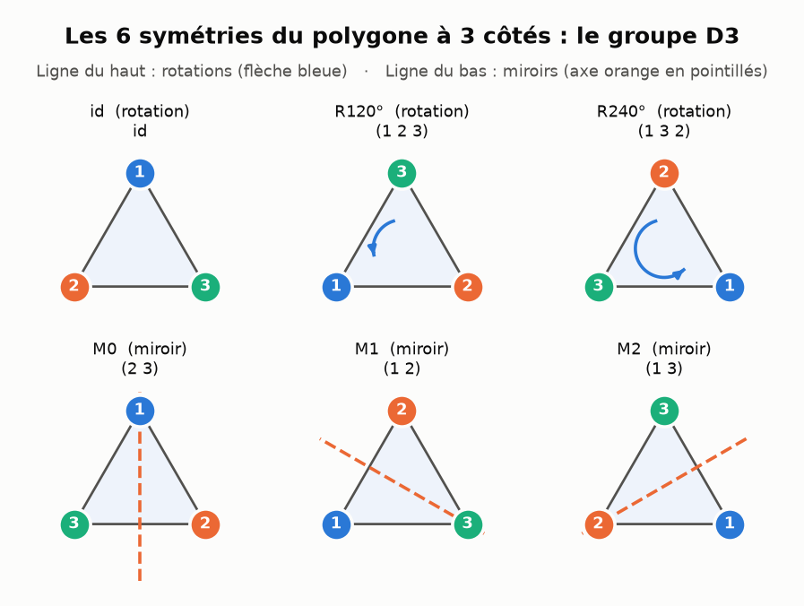
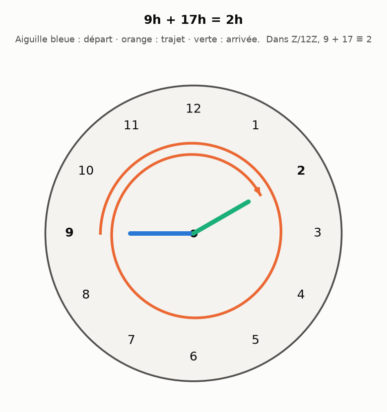
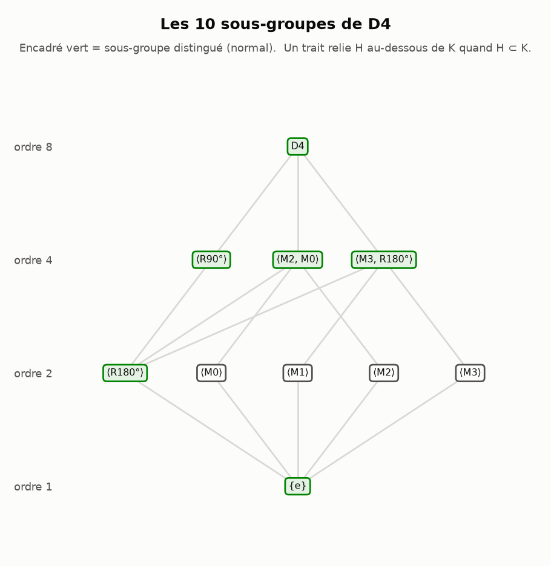
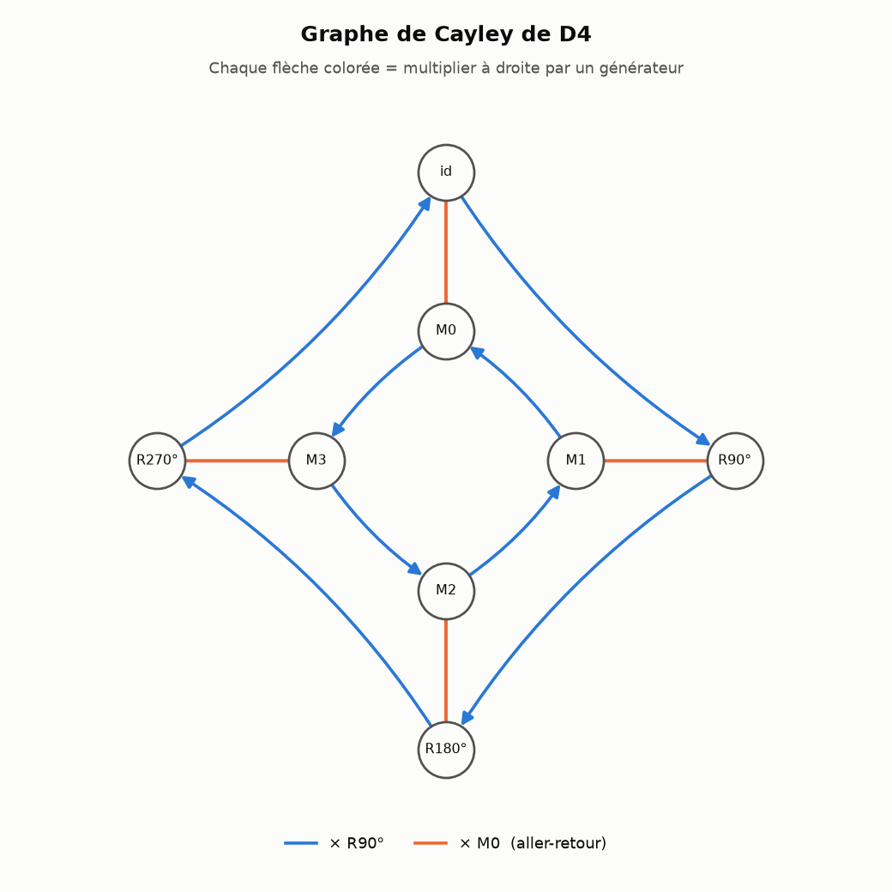
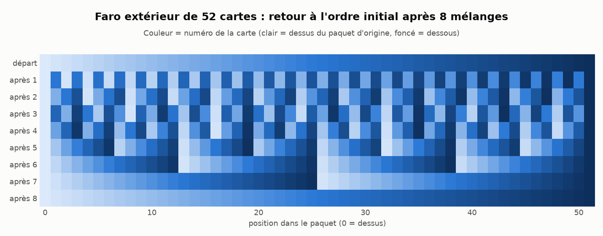
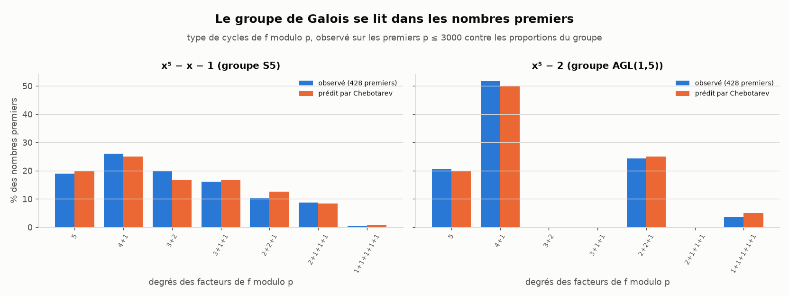
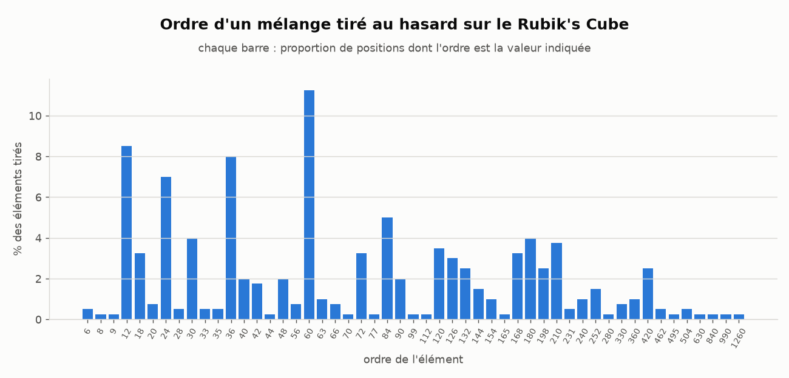
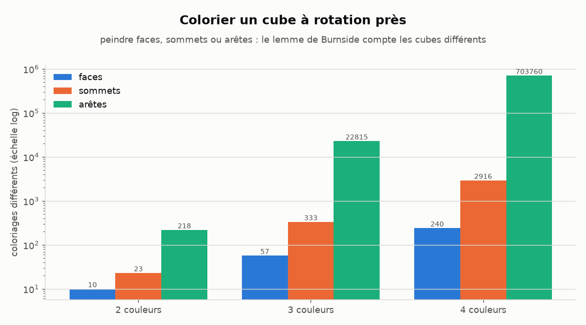
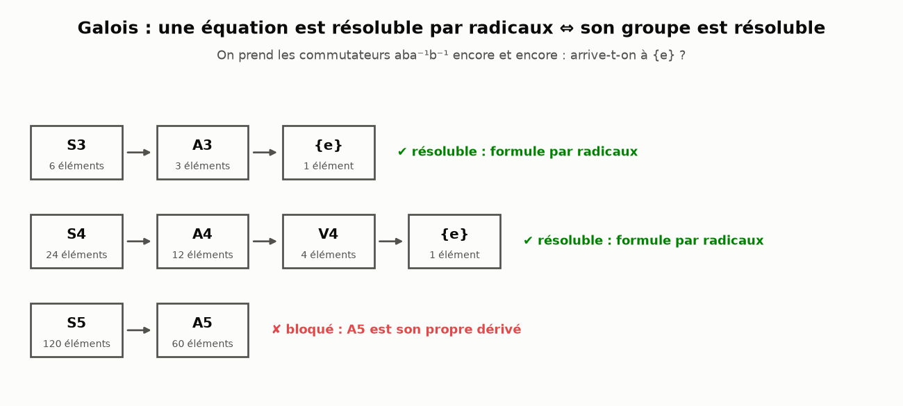

# 🎓 Le laboratoire d'Évariste Galois

Un programme Python pour **découvrir la théorie des groupes en jouant** : des cas
illustrés (une horloge, un triangle en carton, un paquet de cartes, les quaternions…)
jusqu'au résultat qui a rendu Galois célèbre : **il n'existe pas de formule générale
pour résoudre les équations du 5e degré**.

Le programme ne se contente pas d'affirmer : chaque fait affiché est **calculé**
(tables, sous-groupes, isomorphismes, séries dérivées), et un quiz permet de s'entraîner.



## Installation

```sh
pip install -r requirements.txt     # matplotlib, networkx (+ pytest pour les tests)
```

## Utilisation

```sh
python groups-theory-EGalois.py                          # menu interactif
python groups-theory-EGalois.py --cas triangle           # un cas précis (répétable)
python groups-theory-EGalois.py --tout                   # tous les cas, figures à l'écran
python groups-theory-EGalois.py --tout --sauver figures  # figures enregistrées en PNG
python groups-theory-EGalois.py --tout --sans-graphique  # texte seulement
python groups-theory-EGalois.py --quiz 10 --graine 42    # le Défi de Galois (10 questions)
```

## Les 16 cas illustrés

| Cas | Idée | Ce que le programme montre |
|-----|------|----------------------------|
| `horloge` | 9h + 5h = 2h | Z/12Z, ses générateurs (1, 5, 7, 11), le cadran et son graphe de Cayley |
| `triangle` | reposer un triangle dans son trou | les 6 symétries de D3, leur table, la non-commutativité, D3 ≅ S3 |
| `carre` | les 8 symétries du carré | les 10 sous-groupes, le théorème de Lagrange, les classes, les sous-groupes distingués |
| `cartes` | le tour de magie du faro | 8 mélanges parfaits ramènent un jeu de 52 cartes dans l'ordre (52 en faro intérieur !) |
| `imposteurs` | des faux groupes | pour chacun, l'axiome violé **avec un contre-exemple** trouvé automatiquement |
| `quatre` | même taille, autre groupe | Z/4Z ≠ V4 ≅ (Z/8Z)*, D4 ≠ Q8 : l'« empreinte » des ordres des éléments |
| `galois` | l'équation du 5e degré | S3, S4 résolubles ; S5 bloqué sur A5, qui est simple (preuve par les classes de conjugaison) |
| `quotients` | recoller les classes | centre, équation des classes, quotients (D4/Z ≅ V4, S4/V4 ≅ S3), homomorphismes, premier théorème d'isomorphisme, groupes simples |
| `classification` | tous les groupes d'ordre ≤ 12 | les **24** groupes, construits et vérifiés deux à deux non isomorphes ; Z/6 ≅ Z/2×Z/3 mais Z/4 ≇ Z/2×Z/2 ; aperçu de l'ordre 24 |
| `sylow` | combien de sous-groupes de taille p^a ? | n_p calculé pour S4, A5, S5... avec n_p ≡ 1 (mod p) ; A4 n'a pas de sous-groupe d'ordre 6 (réciproque de Lagrange fausse) |
| `cayley` | tout groupe est un groupe de permutations | G ↪ S_\|G\| construit et vérifié (homomorphisme injectif) |
| `burnside` | compter à symétrie près | colliers (14), bracelets (13), cubes peints (10, 57, 240 à 2, 3, 4 couleurs), vérifiés par énumération ; rotations du cube ≅ S4 |
| `crypto` | (Z/nZ)* au travail | générateurs, Diffie–Hellman, logarithme discret en √p, RSA, théorème d'Euler et exposant de Carmichael |
| `rubik` | 43 252 003 274 489 856 000 positions | ordre du Rubik's Cube lu sur une chaîne de stabilisateurs (Schreier–Sims), jamais énuméré ; 2×2×2 : 3 674 160 ; ordre de « R U » : 105 |
| `polynomes` | le groupe de Galois se calcule | S3, Z/3, D4, V4, Z/4, A4, S4 lus sur le discriminant et la résolvante cubique (Kappe–Warren) |
| `quintique` | **prouver** que x⁵ − x − 1 n'est pas résoluble | théorème de Dedekind : factoriser modulo p donne un 5-cycle puis une transposition ⇒ S5 ; densités de Chebotarev vérifiées sur 428 premiers |

### L'horloge : Z/12Z



### Le carré : sous-groupes et graphe de Cayley

| Treillis des sous-groupes (en vert : distingués) | Graphe de Cayley |
|---|---|
|  |  |

### Le mélange parfait de 52 cartes

Chaque ligne est le paquet après un mélange de plus : à la 8e, les couleurs sont revenues dans l'ordre.



### Le groupe de Galois se lit dans les nombres premiers

Pour chaque premier p, la factorisation de f modulo p donne le type de cycles d'un élément du groupe de Galois.
Sur 428 premiers, les fréquences observées suivent celles du groupe (théorème de Chebotarev) : S5 pour x⁵ − x − 1,
le groupe résoluble AGL(1,5) d'ordre 20 pour x⁵ − 2 (jamais de transposition).



### Le Rubik's Cube

| Ordre d'un mélange tiré au hasard | Colorier un cube |
|---|---|
|  |  |

### Les imposteurs (extrait de la sortie)

```
▶ (Z/4Z, -)
  ✔ Fermeture      a·b reste toujours dans l'ensemble
  ✘ Associativité  (0·0)·1 = 3 mais 0·(0·1) = 1
  ✘ Neutre         aucun élément e tel que e·a = a·e = a
  ✘ Inverses       impossible sans élément neutre
  → Ce n'est PAS un groupe.
```

### Galois : pourquoi le degré 5 résiste



## Le Défi de Galois (quiz)

Des questions tirées au hasard dont la réponse est calculée par le programme :
heure sur l'horloge, inverse modulo p, ordre d'une permutation, composition de
symétries, Lagrange, mélanges de cartes, Sylow, Burnside, Diffie–Hellman, RSA, groupe de
Galois d'un polynôme, centre de D_n, ordre d'un algorithme de Rubik's Cube… Indice avec `?` (½ point), séries 🔥, et
un titre final, d'« Apprenti·e calculateur·rice » à « Héritier·ère de Galois ».

```
Question 1/8 — Il est 9h. Quelle heure affichera l'horloge dans 17 heures ?
> 2
   ✔ Bravo !  9 + 17 = 26 ≡ 2 (mod 12) : on ne garde que le reste de la division par 12.
```

## Utiliser la bibliothèque

```python
from groupes import Groupe
import catalogue as cat

G = cat.diedral(4)                       # aussi : cyclique, horloge, symetrique, alterne,
print(G.verifier())                      #         inversibles_mod, klein, quaternions...
print(G.table_texte())
print(G.est_abelien(), G.contre_exemple_commutativite())
print(G.sous_groupes(), G.classes_de_conjugaison())
print(cat.symetrique(5).est_resoluble())  # False : merci Galois !

# Nouveautés : centre, quotient, Sylow, Cayley, produit direct...
D4 = cat.diedral(4)
print(D4.centre(), D4.quotient(D4.centre()).isomorphisme(cat.klein()) is not None)
print(cat.symetrique(5).sylow(2)[1], cat.alterne(5).est_simple(), cat.groupes_d_ordre(8))

# Grands groupes (Rubik) et groupes de Galois de polynômes
import permgroup, galois_polynomes
print(permgroup.cube_rubik(3).ordre())                       # 43252003274489856000
print(galois_polynomes.groupe_de_galois([1, 0, 0, 0, -2]))   # x⁴ − 2 : D4, avec ses raisons
print(galois_polynomes.prouve_s5([1, 0, 0, 0, -1, -1]))      # (True, 3, 163)

# Votre propre groupe (l'ancienne API is_group / identity / inverses marche toujours)
H = Groupe(range(5), lambda a, b: (a + b) % 5, nom="Z/5Z")
print(H.is_group(), H.identity, H.inverses)
```

## Organisation du code

| Fichier | Rôle |
|---------|------|
| `groups-theory-EGalois.py` | programme principal : menu, cas illustrés, options en ligne de commande |
| `groupes.py` | classe `Groupe` : axiomes avec contre-exemples, ordres, sous-groupes, classes, conjugaison, série dérivée, isomorphismes |
| `catalogue.py` | groupes prêts à l'emploi, permutations (notation cyclique), mélanges de cartes, faux groupes |
| `illustrations.py` | les figures matplotlib (tables de Cayley, graphes, polygones, horloge, cartes, treillis) |
| `cas_avances.py` | les 9 cas avancés (quotients, classification, Sylow, Cayley, Burnside, crypto, Rubik, polynômes, quintique) |
| `permgroup.py` | grands groupes de permutations : ordre par Schreier–Sims, cube de Rubik construit par la géométrie, rotations du cube |
| `arithmetique.py` | φ d'Euler, racines primitives, Diffie–Hellman, logarithme discret, RSA, exposant de Carmichael |
| `denombrement.py` | lemme de Burnside : colliers, bracelets, coloriages du cube |
| `galois_polynomes.py` | groupe de Galois exact aux degrés 2 à 4, théorème de Dedekind et densités de Chebotarev |
| `quiz.py` | le Défi de Galois (17 types de questions) |
| `test_groupes.py`, `test_laboratoire.py` | 112 tests, environ 3 s (`python -m pytest -q`) |

Par rapport à la version d'origine, la table de Cayley est calculée une seule fois
(indices entiers) : vérifier les 1,7 million de triplets d'associativité de S5 prend
moins d'un dixième de seconde. Le graphe complet des 36 compositions, illisible, a été
remplacé par des graphes de Cayley construits sur des générateurs.
